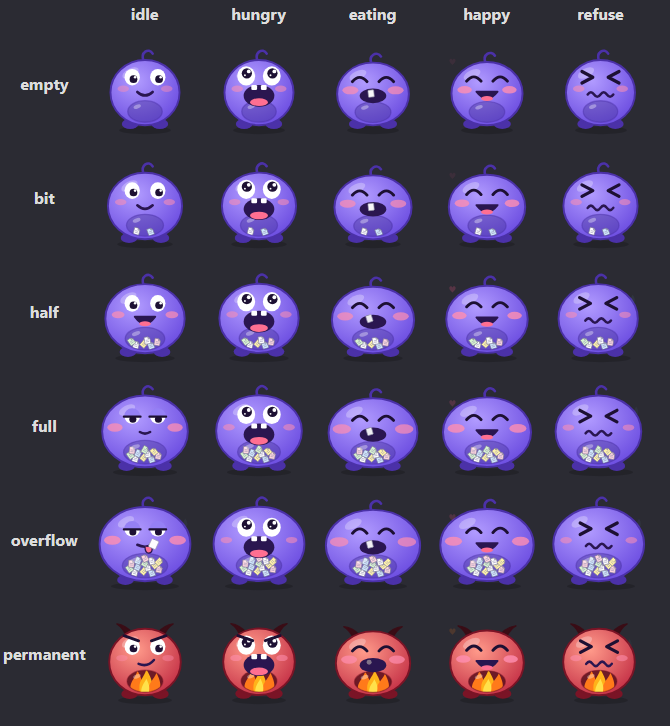
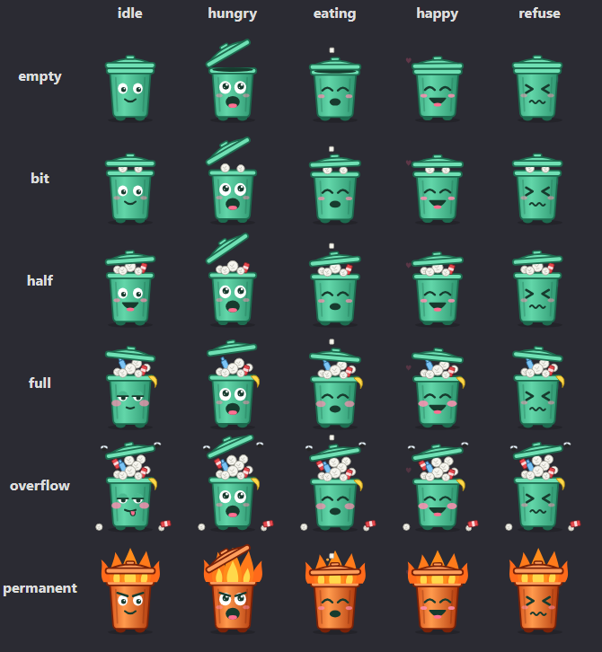

# Character Sprite Guide

Everything an artist (or an AI image tool) needs to make a new Desktop Deleter character.

## What Desktop Deleter is

Desktop Deleter replaces the Windows Recycle Bin icon with a character who eats your files.
He sits in a transparent 160 × 160 px window on the desktop, and you drag files onto him to delete them.

- **Feeding:** dragging files over him makes him hungry; dropping them makes him eat them.
- **His tummy is the Recycle Bin.** Eaten files go to the real Recycle Bin, and how full he
  looks follows how much is in it. Emptying the bin ("Digest" in his menu) empties him.
- **Permanent delete mode** skips the Recycle Bin, so files are gone for good. He switches to a
  separate, clearly different look so the user always knows they're in this mode.
- **Characters are swappable.** Each one is a folder of 30 images plus a small settings file.
  No code is needed to add one.

The app ships with two reference characters: **Chomp** (a purple blob with a see-through belly
that fills with files) and **Binny** (a trash can whose lid is his mouth).

| Chomp | Binny |
| --- | --- |
|  |  |

## How a character works

Every character needs **30 sprites: 6 levels × 5 states**. The level says how full he is (or
that permanent delete is on); the state says what he's doing right now.

**Levels** follow what's in the Recycle Bin:

| Level | Shown when the Recycle Bin holds | What it should convey |
| --- | --- | --- |
| `empty` | nothing | Hungry, eager, slim |
| `bit` | 1–3 items, or about 10 MB | A first snack, content |
| `half` | 4–16 items, or about 50 MB | Clearly eating well, happy |
| `full` | 17–54 items, or about 130 MB | Stuffed, sleepy, food coma |
| `overflow` | 55+ items, or about 500 MB | Can't take any more, things spilling out |
| `permanent` | permanent delete is on (any amount) | Danger: files are destroyed, not stored |

**States** follow what the user is doing:

| State | Shown when | How long |
| --- | --- | --- |
| `idle` | Nothing is happening | Loops until something happens |
| `hungry` | Files are being dragged over him | Until they're dropped or dragged away |
| `eating` | Files were just dropped on him | About 1.4 s |
| `happy` | He finished eating, or was clicked (petted) | About 1.6 s, then back to idle |
| `refuse` | Something couldn't be eaten (a protected folder, or it's missing) | About 2.2 s, then back to idle |

## Sprite checklist and specs

Deliver these 30 files, named `{level}-{state}` plus the file extension (e.g. `half-eating.png`):

| Level | idle | hungry | eating | happy | refuse |
| --- | --- | --- | --- | --- | --- |
| empty | `empty-idle` | `empty-hungry` | `empty-eating` | `empty-happy` | `empty-refuse` |
| bit | `bit-idle` | `bit-hungry` | `bit-eating` | `bit-happy` | `bit-refuse` |
| half | `half-idle` | `half-hungry` | `half-eating` | `half-happy` | `half-refuse` |
| full | `full-idle` | `full-hungry` | `full-eating` | `full-happy` | `full-refuse` |
| overflow | `overflow-idle` | `overflow-hungry` | `overflow-eating` | `overflow-happy` | `overflow-refuse` |
| permanent | `permanent-idle` | `permanent-hungry` | `permanent-eating` | `permanent-happy` | `permanent-refuse` |

### Specs

- **Canvas:** square, shown at 160 × 160 px. Draw at 2× or more (320 × 320 or 512 × 512) so it
  stays crisp on high-DPI screens.
- **Background:** fully transparent. He sits directly on the user's desktop and windows.
- **Formats:** PNG (still), or animated GIF, APNG, WebP or SVG. Use the same format for all 30.
- **Framing:** same canvas size, same ground line and same centre in every sprite, so switching
  states doesn't make him jump. Leave about 10% padding at the top and sides for bounces,
  hearts and flying bits.
- **Animation (optional):** loop seamlessly; `eating` should read within 1.4 s. Still images
  work too, they just won't move.
- **Readability:** he's small on screen, so use bold shapes, thick outlines and big expressions
  over fine detail.

## Designing the levels

The five fill levels should be told apart at a glance, through the drawing itself rather than by
stretching one image. Give each character a visible "meter" that grows (a see-through belly, a
pile of trash, a growing sack), then change the expression to match.

| Level | What changes | Chomp (blob) | Binny (trash can) |
| --- | --- | --- | --- |
| `empty` | Slim body, eager face, meter empty | Empty belly window, big hopeful eyes | Lid shut, eager smile |
| `bit` | First contents visible, small smile | Two little files in his belly | Paper balls peeking out under the lid |
| `half` | Meter clearly half full, big grin | Belly half full, rounder body | Pile with a soda can, lid propped up |
| `full` | Meter packed, sleepy food-coma eyes, puffed cheeks | Belly packed, half-closed eyes | Bottle and banana peel over the rim, sleepy eyes |
| `overflow` | Contents spilling out, sweat, tongue out | A file sticking out of his mouth | Lid perched on a trash tower, papers on the floor, flies |
| `permanent` | A different look that reads as danger | Red devil with horns and fire in his belly | Red-hot fire bin with flames under the lid |

The permanent look matters most: it's the user's only reminder that files won't be recoverable.
Use a strong colour shift (reds and oranges work well) plus a clear motif: fire, smoke, a shredder.

Keep the meter the same between states at a given level. If `half-idle` shows a half-full
belly, `half-eating`, `half-happy` and the others must show the same amount.

## Designing the states

Each state is one pose and expression. If animated, it's one short seamless loop.

| State | Pose and expression | Animation idea |
| --- | --- | --- |
| `idle` | Relaxed; expression set by the level | Slow bob or breathing, an occasional blink |
| `hungry` | Mouth wide open, big eager eyes, leaning in | Excited bouncing, drool, mouth or lid pulsing |
| `eating` | Chewing, eyes squeezed happily shut | Fast chomping, scraps flying, squash-and-stretch. In `permanent`, scraps burn up into smoke or embers |
| `happy` | Big grin, closed happy eyes, blush | A hop, with hearts or sparkles floating up |
| `refuse` | Squeezed `> <` eyes, wavy frown, sweat drop | Head shake |

The `hungry` and `eating` poses carry the core joke, so make the mouth (or lid, or opening) big and obvious.

## Delivering a character

A character is one folder in `src/characters/` holding the 30 sprites and a `character.json`:

```text
src/characters/gobbo/
  character.json
  empty-idle.png  empty-hungry.png  ...  permanent-refuse.png
```

`character.json` names him, points at the sprites, and holds his speech-bubble lines. Only
`name` and `sprites` are required. For pixel art, add `"pixelArt": true` so sprites scale
with sharp square pixels instead of being smoothed.

Still sprites (PNG, WebP) get built-in motion from the app: a bob when idle, heavy breathing
and hiccups when full, a bounce when hungry, chewing, a hop when happy and a head shake when
refusing. SVG and GIF sprites are expected to animate themselves. Override either way with
`"motion": true` or `"motion": false`.

### Idle actions

Characters with motion also do a little idle action every 3–12 seconds, picked at random
(never the same twice running) from `idleActions` in `character.json`:

| Action | What he does |
| --- | --- |
| `shuffle` | Shifts his weight to one side and back |
| `sigh` | Slumps down slowly and back up (bored) |
| `sway` | Slow side-to-side sway (bored) |
| `stretch` | Yawns and stretches tall |
| `doze` | Nods off, with floating z's |
| `turn` | Turns to face the other way for a moment |
| `hover` | Floats up and hovers |
| `teleport` | Flickers out, reappears a step away, snaps back, with sparkles |
| `lunge` | Crouches, then strikes forward (to the right) |
| `stomp` | Two heavy stomps |

```json
"idleActions": ["teleport", "turn", "sway", "sigh", "shuffle"],
"fxColor": "#5be05b"
```

Without a list he uses `shuffle`, `sigh`, `sway` and `stretch`. `fxColor` colours the sparkles.

### Optional: blinking and glancing

For extra life while idle, add up to three frames per level, named with the same pattern:
`{level}-idle-blink`, `{level}-idle-look-left` and `{level}-idle-look-right` (e.g.
`half-idle-blink.png`). Every few seconds he blinks (sometimes twice) or glances to one side.
Each must match its `{level}-idle` sprite exactly except for the eyes, or he'll visibly jump.

For pixel-art characters, `node tools/gen-idle-frames.mjs <id>` can make them by editing the
eyes of the idle sprites. Describe the character's eyes (colour and position) in the `EYES`
table at the top of that script first. Levels where it can't find the eyes are skipped.

```json
{
  "name": "Gobbo",
  "author": "your name",
  "sprites": "{level}-{state}.png",
  "lines": {
    "hungry":       ["Gimme!"],
    "eat":          ["Yum!", "That's {total} files eaten!"],
    "full":         ["So full..."],
    "permanentEat": ["Incinerated!"],
    "refuse":       ["Can't eat"],
    "pet":          ["Hehe"],
    "digestStart":  ["Hrrngh..."],
    "digest":       ["Ahh, much better!"]
  }
}
```

| Line set | When he says it |
| --- | --- |
| `hungry` | Files are dragged over him |
| `eat` | After eating (`{count}` = files just eaten, `{total}` = all-time) |
| `full` | After eating at the `full` or `overflow` level |
| `permanentEat` | After eating in permanent delete mode |
| `refuse` | Before the reason something couldn't be eaten |
| `pet` | When clicked |
| `digestStart`, `digest` | While and after the Recycle Bin is emptied |

He never speaks on his own, only in response to the user.

To finish:

1. Add the folder name (`"gobbo"`) to `src/characters/index.json`.
2. Run `node tools/check-character.mjs gobbo`. It lists any missing sprites.
3. Pick him from the right-click menu under **Characters**.

A missing sprite falls back to that level's `idle`, then to `empty`, so a half-finished
character still works while you draw.

## Making sprites with AI

The hard part is keeping one character identical across 30 images, not image quality. Pick a
tool that edits from reference images, design one sprite you love, and derive the other 29 from it.

| Tool | Good for | Transparent background | Notes |
| --- | --- | --- | --- |
| [OpenAI GPT Image](https://developers.openai.com/api/docs/guides/image-generation) (ChatGPT or API) | Editing one base sprite into variants; accepts several reference images | Yes, via the API (`background: "transparent"`, PNG or WebP) | Best fit for this workflow |
| Google Gemini image ("Nano Banana") | Strong identity consistency from multiple reference images | Not documented; use a solid background and remove it | Good alternative |
| [Leonardo AI](https://fast.io/resources/best-ai-character-generators-2026/) | Character Reference + custom model training for a fixed style | Background removal tool | Free tier; paid from $12/month |
| [Scenario](https://fast.io/resources/best-ai-character-generators-2026/) | Training a model on your own art so every future character matches | Background removal tool | Built for game studios; contact sales |
| [Midjourney](https://fast.io/resources/best-ai-character-generators-2026/) | Highest-quality first design (Omni Reference) | No | $10–$120/month; weaker at precise edits |

AI drifts between animation frames ([Summer Engine](https://www.summerengine.com/blog/ai-2d-game-asset-generator)),
so generate still PNGs and add motion separately.

### Workflow

1. Generate `empty-idle` until you love it. This is the character's model sheet; every other
   sprite is an edit of it.
2. Make the other levels' idles by editing the base: same character, more food in the meter,
   new expression. Then make `permanent-idle`.
3. For each level, make the 4 other states by editing that level's idle.
4. Remove backgrounds if needed, then place every sprite on the same square canvas with the
   same ground line.
5. Name the files, add `character.json`, and run the checker.

### Prompt template

Attach the base sprite as the reference image:

```text
Same character as the reference image: identical design, colours, outline
thickness, art style and framing. Square canvas, transparent background,
character centred and standing on the same ground line, cute cartoon
desktop-pet style with thick outlines.

Level: {half} – {his see-through belly is half full of small paper files}.
State: {eating} – {chomping with eyes squeezed happily shut, paper
scraps flying from his mouth}.
```

*Tool details checked October 2026; pricing and features change, so confirm on each site.*
